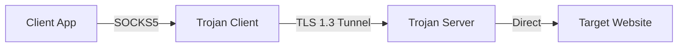

# Trojan-Pro

A high-performance C++ implementation of the Trojan protocol, designed for speed and reliability.

Trojan-Pro is built upon the core principles of the original [Trojan](https://github.com/trojan-gfw/trojan) project, offering a lightweight and efficient solution for bypassing network restrictions through HTTPS mimicry.

## Features

- **High Performance**: Built with C++17 and Boost.Asio for efficient asynchronous I/O and low resource usage.
- **Multithreading Support**: Configurable thread pool to utilize all available CPU cores.
- **Memory Optimization**: Reduced-copy buffer reuse to minimize allocation overhead and latency.
- **Trojan Protocol**: Mimics HTTPS traffic to bypass deep packet inspection (DPI) and ISP QoS limitations.
- **TLS 1.3**: Fully supports TLS 1.3 for state-of-the-art security and forward secrecy.
- **SOCKS5 Support**: Acts as a standard SOCKS5 proxy server for clients.
- **NAT Support**: Transparent proxy capability on Linux.
- **Database Integration**: MySQL support for multi-user management and authentication.

## Architecture



1.  **Client**: Your browser or application sends traffic to the local Trojan SOCKS5 interface.
2.  **Trojan Client**: Encapsulates the traffic in a TLS tunnel that looks exactly like a standard HTTPS connection.
3.  **Trojan Server**: Decrypts the traffic, verifies the password, and forwards the data to the destination.
4.  **Security**: The connection is secured with TLS 1.3, ensuring confidentiality and integrity. If a non-Trojan probe connects (e.g., a web crawler), the server responds like a standard web server, hiding the proxy functionality.

## Prerequisites

-   **CMake** >= 3.7.2
-   **Boost** >= 1.66.0
-   **OpenSSL** >= 1.1.0
-   **MySQL Connector/C** (Optional, for database support)

## Build

### Quick Build (Recommended)

We provide a script to automatically detect your environment and build the project:

```bash
# Build for your current platform
./scripts/build-trojan-core.sh

# The binary will be available at:
# dist/trojan
```

### Manual Build

```bash
mkdir -p build && cd build
cmake .. -DCMAKE_BUILD_TYPE=Release
make -j$(nproc)
```

### Docker

You can also build and run Trojan-Pro using Docker.

**Build:**

```bash
docker build -t trojan-pro .
```

**Run:**

```bash
docker run -d --name trojan \
  -v /path/to/config.json:/config/config.json \
  -p 443:443 \
  trojan-pro
```

## Quick Deployment (Recommended)

We provide an all-in-one deployment script that handles Trojan + Caddy setup automatically:

```bash
# Interactive deployment
bash <(curl -sL https://raw.githubusercontent.com/proxy-trojan/trojan-obfuscation/main/scripts/deploy_caddy_trojan.sh)

# Non-interactive deployment
./scripts/deploy_caddy_trojan.sh --domain example.com --email admin@example.com --password yourpass --mode host --core download --auto
```

### Deployment Features

| Feature | Description |
|---------|-------------|
| **Installation Modes** | Download pre-compiled binary (fast) or compile from source |
| **Certificate Options** | Domain certs (Let's Encrypt/ZeroSSL/Buypass) or IP certs (6-day short-lived) |
| **Notifications** | Telegram, DingTalk, Feishu, Slack, Bark, ServerChan |
| **Management** | Backup/restore configurations, multi-user password management |
| **Optimization** | TCP BBR congestion control, health check |

### CLI Options

```bash
Options:
  --domain <domain>      Domain name for certificate
  --email <email>        Email for certificate registration
  --password <pass>      Trojan password
  --mode <host|docker>   Installation mode
  --core <download|compile>  Core installation method
  --cert-type <domain|ip>    Certificate type
  --ca <letsencrypt|zerossl|buypass>  Certificate Authority
  --auto                 Non-interactive mode
```

## Configuration

### Server Configuration (`server.json`)

```json
{
    "run_type": "server",
    "local_addr": "0.0.0.0",
    "local_port": 443,
    "remote_addr": "127.0.0.1",
    "remote_port": 80,
    "password": [
        "your_strong_password"
    ],
    "ssl": {
        "cert": "/path/to/fullchain.crt",
        "key": "/path/to/private.key",
        "sni": "your-domain.com"
    },
    "threads": 4
}
```

-   `remote_addr`/`remote_port`: Where to forward invalid/probe traffic (e.g., a local Nginx/Apache server).
-   `ssl.cert`: Path to your server's certificate file.
-   `ssl.key`: Path to your server's private key.
-   `threads`: Number of worker threads. Defaults to the number of CPU cores if set to 0 or omitted.
-   `abuse_control`: Lightweight guardrails for per-IP concurrency, authentication-failure cooldown, and fallback session budgeting.

### Client Configuration (`client.json`)

```json
{
    "run_type": "client",
    "local_addr": "127.0.0.1",
    "local_port": 1080,
    "remote_addr": "your-domain.com",
    "remote_port": 443,
    "password": [
        "your_strong_password"
    ],
    "ssl": {
        "verify": true,
        "sni": "your-domain.com"
    }
}
```

## Usage

After building and configuring:

```bash
# Run as server
./trojan -c server.json

# Run as client
./trojan -c client.json
```

## Client Product (New)

A new desktop-first, mobile-ready client shell is now being scaffolded under:

```bash
client/
```

Current client scope focuses on product-layer foundations:
- profile management shell
- settings/state model
- secure storage abstraction
- diagnostics export preview
- fake controller boundary for future engine integration

See:
- `docs/client-product-architecture.md`
- `docs/adr-client-product-stack.md`
- `client/README.md`

## Validation

The current baseline includes Linux smoke/integration tests for:

- basic CLI/config validation
- expected failure on placeholder server config
- authentication-failure cooldown
- fallback session budgeting

Run them locally with:

```bash
cmake -S . -B build/scan -DCMAKE_BUILD_TYPE=Release -DENABLE_MYSQL=OFF -DENABLE_SSL_KEYLOG=OFF
cmake --build build/scan -j$(nproc)
ctest --test-dir build/scan --output-on-failure -j2
```

## Precautions

1.  **Certificates**: You must have a valid domain and a trusted SSL certificate (e.g., from Let's Encrypt). Self-signed certificates may trigger security warnings and are not recommended for production.
2.  **Time Synchronization**: Ensure the system time on both client and server is accurate. Large time discrepancies can cause TLS handshake failures.
3.  **Port 443**: It is highly recommended to use port 443 for the server to blend in with normal HTTPS traffic.

## License

This project is licensed under the [GPLv3 License](LICENSE).
